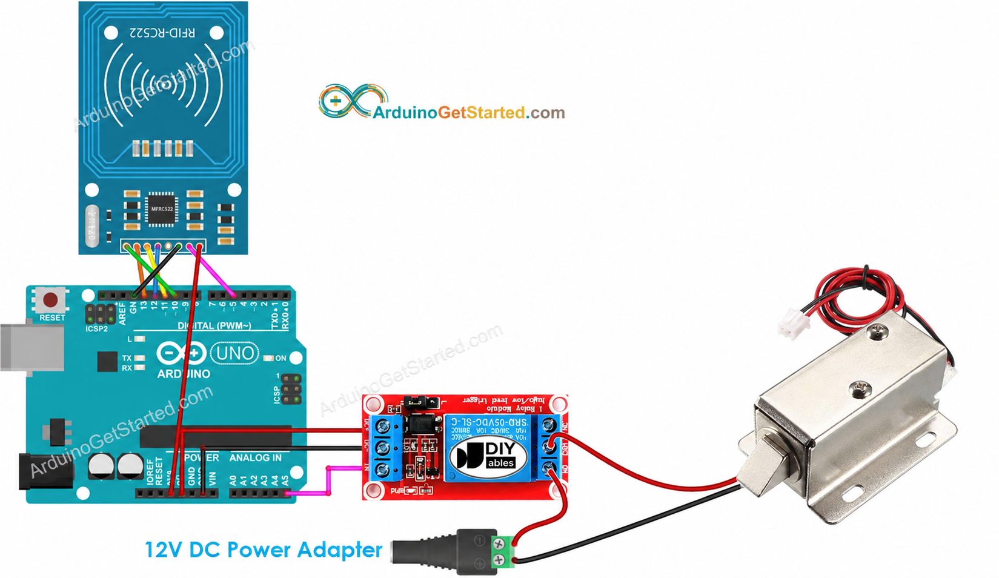

# RFID Secure Access Control System With Java Implementation

An Arduino-based RFID access control system that authenticates keycards and controls a solenoid lock via a relay module. Access attempts are logged in real time through a Java serial logger that writes timestamped entries to a local log file.

> **Course:** Software Engineering | Manhattan University
> **Team:** Michael Zadrima, Myron Corpuz, Christian Hernandez

---

## Purpose
Traditional lock systems require physical keys that can be lost or duplicated. This project implements a keycard-based access control system using affordable, off-the-shelf components — demonstrating how security technology can be built efficiently with limited resources.

---

## How It Works

1. RFID reader scans a keycard and reads its UID
2. Arduino compares the UID against the stored authorized UID
3. If matched — relay activates, solenoid lock unlocks for 3 seconds
4. If denied — relay stays off, access is denied and logged
5. After 3 consecutive failed attempts — system locks out for 10 seconds
6. Java logger receives all serial output and writes timestamped entries to `access_log.txt`

---

## Demo
[Watch Demo](your-youtube-link-here)

> **Note:** The demo shows the original version of the system. The current code includes additional features — failed attempt tracking, 10-second lockout after 3 denied scans, uptime timestamps, and automated Java access logging to a .txt file.

---

## Circuit Diagram



---

## Components & Wiring

**Hardware**
- Arduino Uno
- MFRC522 RFID Reader
- Relay Module
- 12V Solenoid Lock
- Breadboard & Jumper Wires

**Pin Assignments**
| Component | Arduino Pin |
|---|---|
| RFID SS (SDA) | D10 |
| RFID RST | D9 |
| Relay Module | D8 |
| RFID SCK | D13 |
| RFID MOSI | D11 |
| RFID MISO | D12 |

**Software**
- Arduino IDE
- Java with JSerialComm Library
- Eclipse IDE

---

## Features
- RFID keycard authentication against stored authorized UID
- Relay-controlled solenoid lock — unlocks for 3 seconds on valid scan
- Uptime timestamp printed on every scan
- Failed attempt counter displayed after each denial
- Auto-lockout for 10 seconds after 3 consecutive failed attempts
- Java serial logger with real-time timestamps
- Automatic logging to `access_log.txt` in append mode

---

## Sample Output

**Java Console:**
```
Connected to Arduino...
[2026-06-16 14:22:01] Arduino: System ready. Waiting for RFID card...
[2026-06-16 14:22:05] Arduino: [42s] Card detected.
[2026-06-16 14:22:05] Arduino: UID:  33 54 B9 03
[2026-06-16 14:22:05] Arduino: ACCESS GRANTED
[2026-06-16 14:22:15] Arduino: [55s] Card detected.
[2026-06-16 14:22:15] Arduino: UID:  AA BB CC DD
[2026-06-16 14:22:15] Arduino: ACCESS DENIED. Failed attempts: 1
[2026-06-16 14:22:25] Arduino: TOO MANY FAILED ATTEMPTS. SYSTEM LOCKED FOR 10 SECONDS.
[2026-06-16 14:22:35] Arduino: LOCKOUT LIFTED. System ready.
```

**access_log.txt:**
```
=== Session Started: 2026-06-16 14:22:00 ===
[2026-06-16 14:22:01] Connected to Arduino.
[2026-06-16 14:22:05] ✔ ACCESS GRANTED
[2026-06-16 14:22:15] ✘ ACCESS DENIED
[2026-06-16 14:22:20] ✘ ACCESS DENIED
[2026-06-16 14:22:25] ⚠ SYSTEM LOCKED
[2026-06-16 14:22:35] ✔ LOCKOUT LIFTED
```

---

## Test Results

| Test Case | Expected Result | Actual Result | Pass/Fail |
|---|---|---|---|
| Valid Card Scan | Relay activates, unlocks | Relay clicks, unlocks | ✅ |
| Invalid Card Scan | No relay action, denied | No action, ACCESS DENIED | ✅ |
| Serial Output Check | Message shows result | Message shown | ✅ |
| Java Console Test | Message in console | Message appeared | ✅ |

---

## Requirements

**Functional**
- Authenticate RFID keycards within 2 seconds
- Unlock solenoid for valid cards
- Log all access attempts (success & failure)
- Lock system after 3 consecutive failed attempts

**Non-Functional**
- Reliability: ≥95% system uptime
- Durability: Handle 100+ consecutive scans without failure
- Accuracy: Valid keycard scan succeeds with ≥99% reliability

---

## Libraries & Dependencies

**Arduino**
- `SPI.h` (built into Arduino IDE)
- `MFRC522` — install via Arduino Library Manager

**Java**
- `jSerialComm` — add via Maven or download from [fazecast.github.io/jSerialComm](https://fazecast.github.io/jSerialComm/)

---

## Setup

1. Upload `rfid_access_control.ino` to Arduino Uno
2. Wire components per the table above
3. Update `authorizedUID[]` in the Arduino code with your card's UID
4. Update `serial_port` in `RFIDLogger.java` to match your COM port
5. Run `RFIDLogger.java` in Eclipse with jSerialComm on the classpath
6. Scan cards — access log will be written to `access_log.txt`

---

## Future Work
- Buzzer and LED feedback for granted/denied without needing a screen
- Admin interface to add/remove authorized cards
- Multiple user support with named card profiles
- LCD display for on-device status feedback
